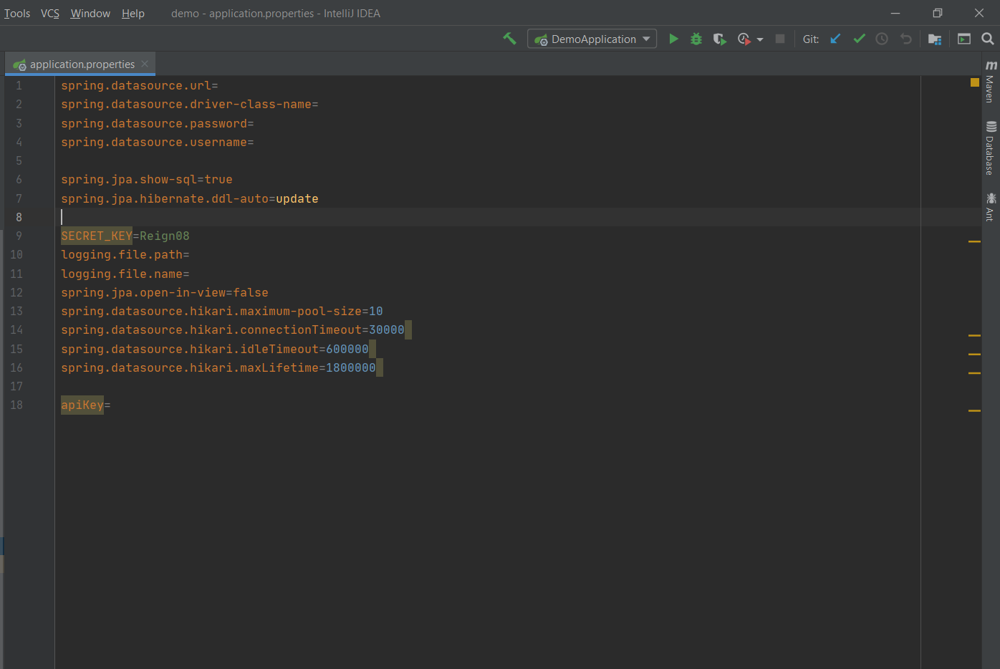

# Movie08
 [movie08.netlify.app](https://movie08.netlify.app/popular)  
It's a app movie API developed by me in order to practice the use of base crud operation and jwt token in spring boot.    
Used:  
- Spring MVC;  
- Spring Data JPA;  
- Spring Security(jwt);  
- Spring AOP;  
- Postgresql;       

API allowes:      
- to filter and search for movie database (using TMDB API);    
- to view movie details;   
- create User Account to build own watch lists and write comments.
## API Reference

```http
  You must need API Key from TMDB API and to run app.
  Also configure application.properties file
```


P.S. If you want UI part,use [movie08UI](https://github.com/smikayilov08/movie08UI)


  


  